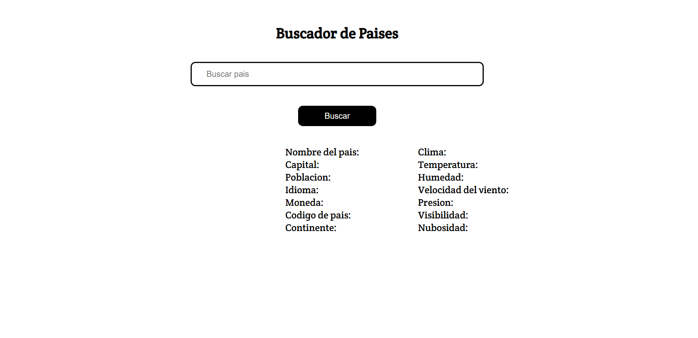
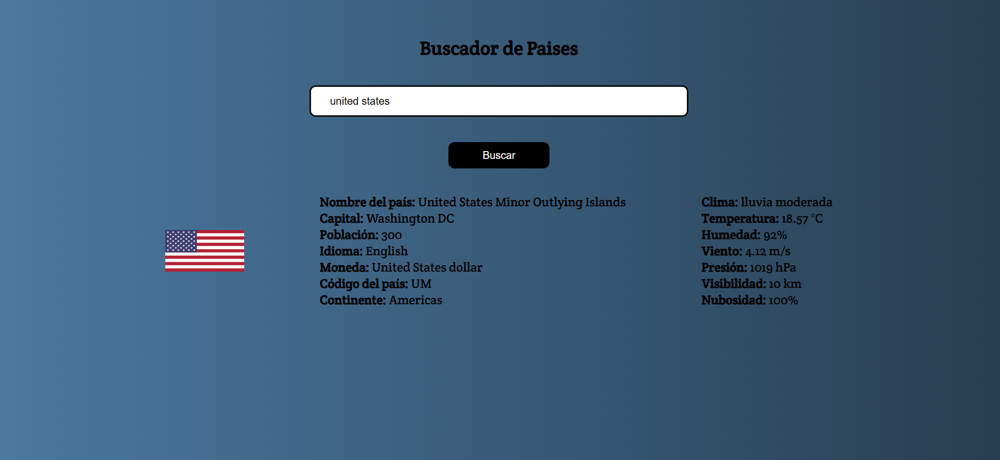
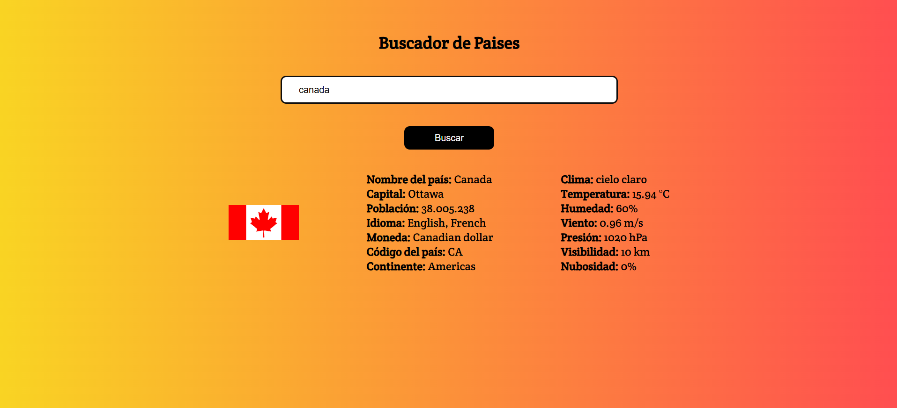

# 🌍 Buscador de Países + Clima

Este es un proyecto web interactivo que permite buscar información de cualquier país del mundo y mostrar el clima actual en su capital. Además, el fondo de la página cambia dinámicamente según la temperatura del país consultado. ¡Ideal para practicar consumo de APIs y lógica en JavaScript!

---

## 🔍 Funcionalidades

- 🔎 Buscar país por nombre
- 🧾 Mostrar datos como: bandera, región, población, capital, idiomas, etc.
- ☁️ Mostrar clima actual (temperatura, clima, sensación térmica)
- 🎨 Cambiar color de fondo dinámicamente según el clima
- 📱 Diseño responsive para móviles y pantallas pequeñas

---

## ⚙️ Tecnologías usadas

- HTML5
- CSS3
- JavaScript

---

## 🌐 APIs utilizadas

- [`REST Countries`](https://restcountries.com) – Para obtener información detallada del país
- [`OpenWeatherMap`](https://openweathermap.org/api) – Para consultar el clima actual en la capital del país

---

## 🖼️ Capturas

### Vista general


### Cambio de fondo por clima
![Clima y fondo dinámico]




---

## 🚀 Ver en línea

🔗 [https://nohemi125.github.io/BuscadorPaises/](https://nohemi125.github.io/BuscadorPaises/)

---

## 📦 Instalación local

```bash
git clone https://github.com/nohemi125/BuscadorPaises.git
cd BuscadorPaises
# Luego abre el archivo index.html en tu navegador
